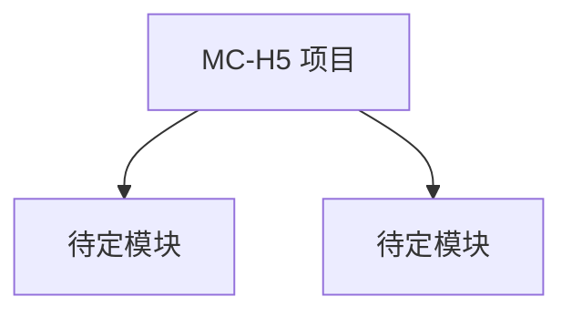

# MC-H5 项目文档

> 🤖 AI 助手初始化于 2026-01-22 19:25
>
> 本文档将随着项目开发持续更新

## 📋 项目概览

- **项目名称**: MC-H5
- **项目类型**: 待定
- **开发阶段**: 初始化阶段
- **最后更新**: 2026-01-22

## 🏗️ 架构总览



## 📁 目录结构

```
/root/mc-h5/
├── CLAUDE.md                    # 本文档
├── .claude/                     # Claude 配置目录
│   └── settings.local.json     # 本地权限配置
└── [待添加项目文件]
```

## 🎯 项目愿景

**待定** - 请根据实际项目需求填写

## 🔧 技术栈

**待定** - 项目启动后确定

## 📚 模块索引

暂无模块

## 📖 使用说明

### 添加模块

1. 创建新的功能模块目录
2. 在模块目录中添加 `CLAUDE.md` 文档
3. 更新根级 `CLAUDE.md` 中的模块索引

### 文档规范

- 所有代码文件应添加注释说明功能
- 接口和 API 应有清晰文档
- 定期更新架构图和模块说明

## 🛠️ 开发规范

### 🔍 开发前准备

**重要工作流程：**
1. **网络调研** - 每次开发前，先上网搜索相关的知识和代码
2. **规范查询** - 使用 context7 mcp 搜索最佳实践和规范
3. **知识整合** - 将调研结果融入开发方案

### 代码质量

- 遵循项目选择的编程规范
- 添加单元测试
- 代码审查前确保测试通过

### 文档要求

- 复杂逻辑必须添加注释
- 公共 API 需要文档说明
- 定期更新架构文档

---

## 🚀 下一步行动

1. 确定项目类型和主要功能
2. 选择技术栈
3. 创建基础项目结构
4. 添加核心模块
5. 编写模块级 CLAUDE.md

## 📞 联系信息

项目负责人：[待定]
最后更新：2026-01-22 19:25
